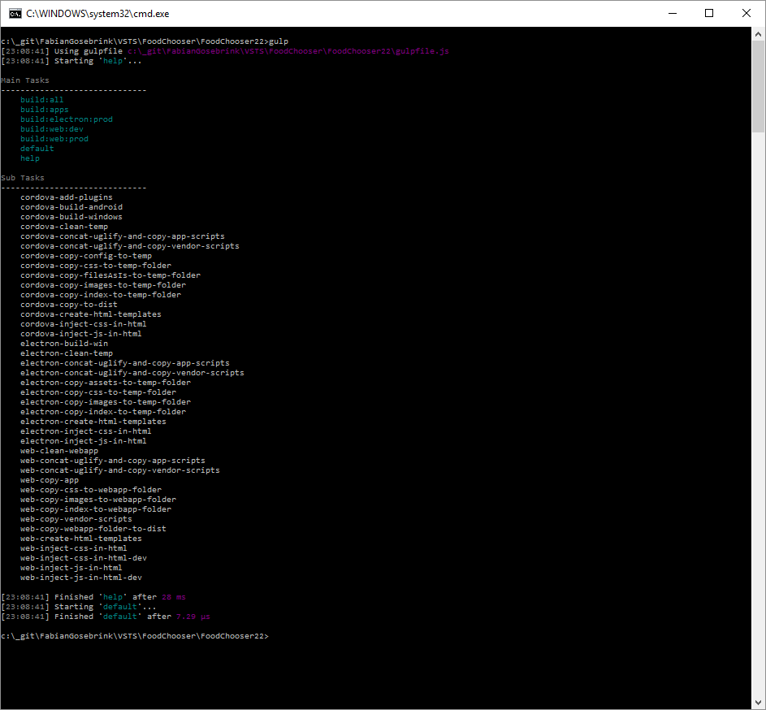
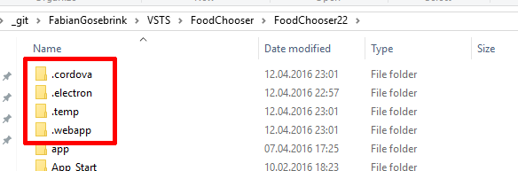
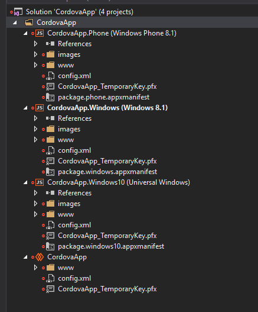
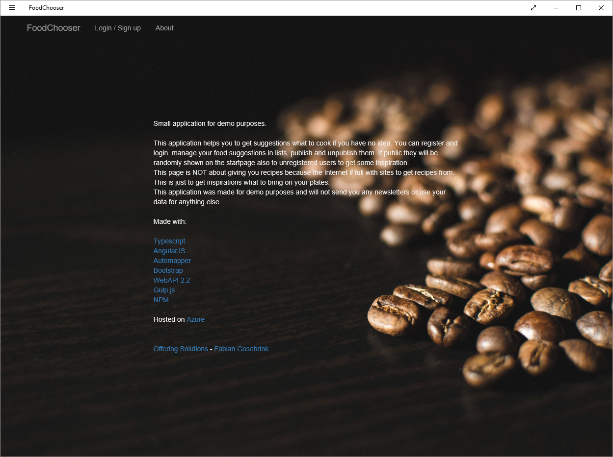
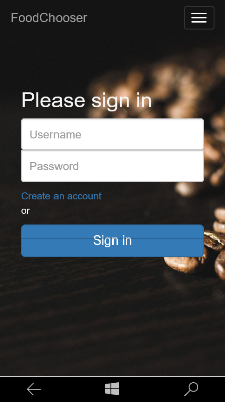
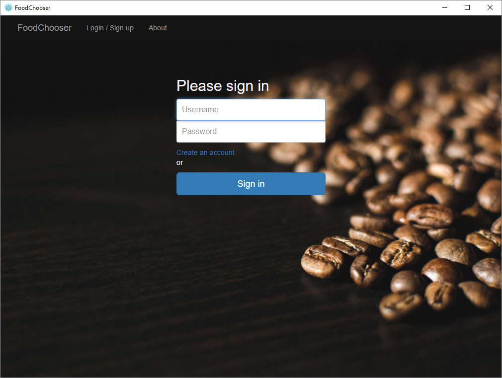

#Foodchooser - ASP.NET WebAPI AngularJs Cross Platform 

> Get the Android SDK here [Android SDK](https://developer.android.com/sdk/index.html/ "Android SDK")  
> Get the Windows SDK here [Windows SDK](https://developer.microsoft.com/en-us/windows/downloads/windows-10-sdk "Windows SDK")


###In this repository we have done an example app with 

* AngularJs
* Typescript
* Bootstrap
* Automapper
* WebAPI 2.2
* Gulp.js
* NPM 
* Azure

to make it cross platform, which means its working as an exe, as an app on phones and as a web application.

This is done with

* Cordova (for the Apps)
* Electron (for the exe)
* Gulp (for the web application)
* ASP.NET WebAPI (for the backend)

Feel free to add gulp tasks as you want :)

##This is the Angular 1 Version of the Foodchooser-Example. Find the Angular 2 Version here: [Angular 2 Version](https://de.wikipedia.org/ "FoodChooser Angular2")

##The API is running on Azure available on http://newFoodChooser.azurewebsites.net

Type in <pre>gulp</pre> to get a ist of all the tasks available



With <pre>gulp build:all</pre> you can build all variations the repository brings. 



###If run "gulp build:all" you will notice one "/webapp" folder and one "/.webapp" (with a dot). The "/.webapp" is for development. In production case the "/.webapp" is distributed to the normal "/webapp" folder too. If you right-click and publish to azure the redirect rule in the web.config will take the files from the distributed webapp folder "/webapp".

```html
<!-- Rewrite rule to take webapp from /webapp" folder -->
<rewrite>
      <rules>
        <clear />
        <rule name="Root Hit Redirect" stopProcessing="true">
          <match url="^$" />
          <action type="Redirect" url="/webapp/" />
        </rule>
      </rules>
    </rewrite>
</pre>
```


#Screenshots

## Cordova-Project in Visual Studio


## Windows 8.1 App


## Windows 10 Mobile


## Executable (Electron)


